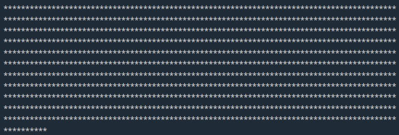
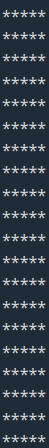

# Laboratoire 02

## Objectif

Mettre en pratique les notions vues à la deuxième semaine du cours sur les boucles `while` et `for`. Les notions précédentes sur les structures conditionnelles seront mobilisées également.

## Prérequis

Clonez ce dépôt à la racine du répertoire contenant les fichiers Web de votre installation Xampp. Utilisez ensuite un navigateur Web pour accéder à l'adresse `/lab02` sur votre serveur local.

Vous devriez voir une page avec le titre « Laboratoire 02 ».

Ouvrez ensuite le dossier `lab02` dans Visual Studio Code. Prenez connaissance des fichiers qu'il comprend. Vous constaterez qu'il y a un fichier `index.php` (page d'accueil du laboratoire) et plusieurs fichiers `exerciceX.php` où `X` est un numéro d'exercice.

## Exercice 0 - Page d'accueil

Pour commencer, il serait agréable d'avoir une liste de liens vers chaque exercice sur la page d'accueil (`index.php`)

TODO

## Exercice 1

### Exercice 1.1

Dans le fichier `exercice1.php`, ajoutez le titre *h1* `Exercice 1`, suivi du titre *h2* `Exercice 1.1`. Ensuite, utilisez une boucle **while** pour afficher les nombres 1 à 10 dans une liste non ordonnée (`ul`).

### Exercice 1.2

Sous l'exercice 1.1, ajoutez un exercice 1.2. Pour celui-ci, utilisez une boucle **do...while** pour afficher de nouveau les nombres 1 à 10.

### Exercice 1.3

Ajoutez ensuite un exercice 1.3. Dans celui-ci, utilisez une boucle **for** pour afficher les nombres 1 à 10.

### Exercice 1.4

Pour l'exercice 1.4, utilisez une boucle **while** pour afficher les nombres en ordre décroissant de 10 à 1.

### Exercice 1.5

Pour l'exercice 1.5, faites la même chose qu'à l'exercice 1.4, mais cette fois-ci avec une boucle **for**.

### Exercice 1.6

Pour l'exercice 1.6, utilisez une boucle **while** pour afficher les nombres **pairs** de 0 à 20.

## Exercice 1.7

Pour l'exercice 1.7, faites la même chose qu'à l'exercice 1.6, mais cette fois-ci avec une boucle **for**.

## Exercice 1.8

Utilisez une boucle **while** pour afficher les 20 premiers nombres de la suite de Fibonacci. Cette fois-ci, utilisez une liste ordonnée (*ol*) pour qu'on puisse facilement valider qu'il y a bien 20 nombres.

## Exercice 1.9

Faites afficher de nouveau la suite de Fibonacci, mais cette fois-ci en utilisant une boucle **for**.

# Exercice 2

Dans le fichier `exercice2.php`, utilisez une boucle **for** pour afficher 1000 étoiles (caractère `*`) à l'écran. Le CSS lié à la page ajoutera des sauts de ligne automatiquement.

Modifiez ensuite votre code pour afficher le nombre d'étoiles correspondant au paramètre `etoiles` passé par l'URL. Utilisez une valeur par défaut de 1000 si le paramètre est absent. Si le paramètre est présent mais invalide (non numérique), affichez un message d'erreur, puis n'affichez aucune étoile.

Une fois que tout fonctionne, modifiez votre code à nouveau pour prendre en compte un deuxième paramètre `saut`. Si ce paramètre est présent, il doit déterminer à quelle fréquence (après combien d'étoiles) votre code doit produite un saut de ligne. Si le paramètre est absent, ne générez pas de saut de ligne. Si le paramètre est présent mais invalide, affichez un message d'erreur. Par exemple, si les paramètres sont `etoiles=100`et `saut=5`, le résultat doit être le suivant:

